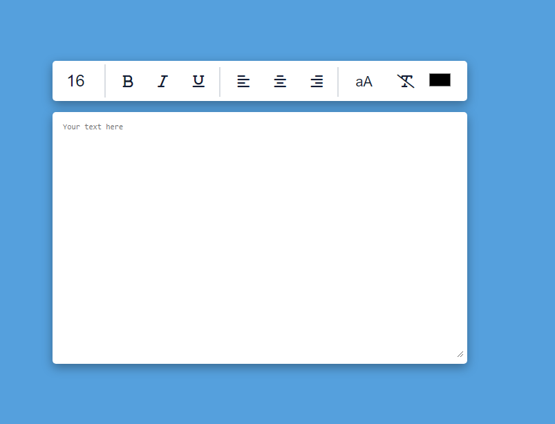
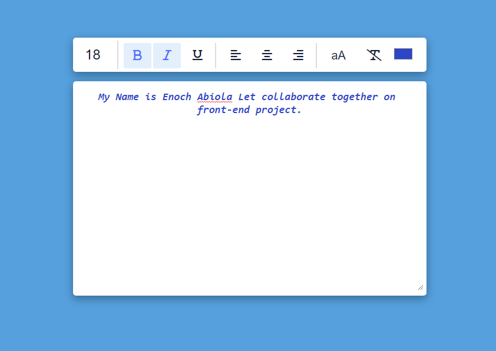

# Text-Editor
It a text editor that allows users to manipulate and edit the text written.... By 
1. Adding colors
2. Changing text size
3. And ability to change text position to either left, center or right

<strong>This is the Screenshot of the editor</strong>

1. This is the design of the Editor

   

2. This is when text is passed into the editor

